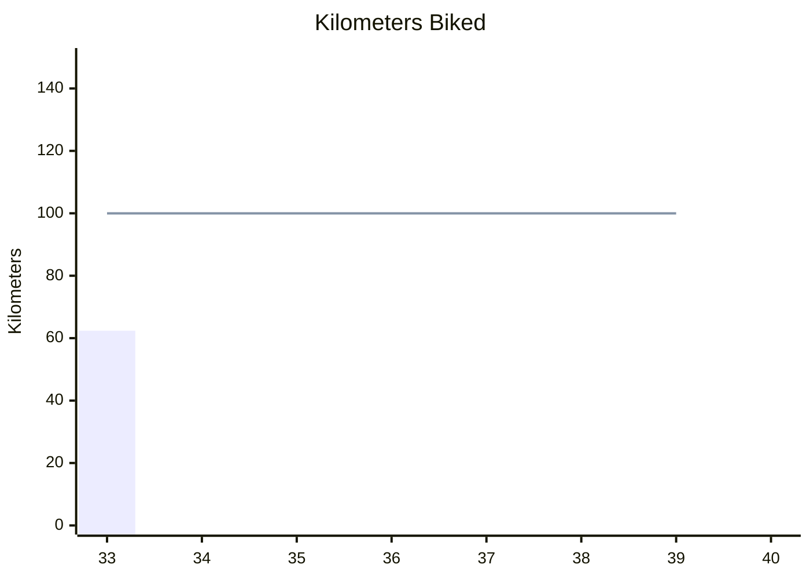

This is a sample of 4DX in a simpler format
# WIG
Complete a 100 KM ride by end of the year
# LEAD MEASURES

```mermaid
xychart-beta
    title "Kilometers Biked"
    x-axis [33, 34, 35, 36, 37, 38, 39, 40]
    y-axis "Kilometers" 0 --> 150
    bar [62.4]
    line [100, 100, 100, 100, 100, 100, 100]
```
